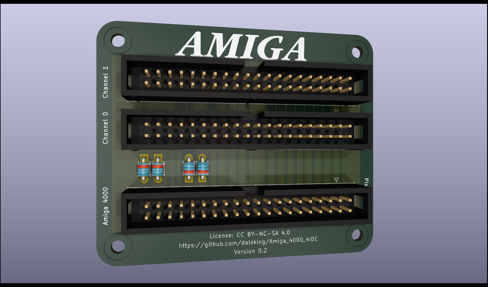

# Amiga 4000 4 way IDE Adaptor [UNTESTED]

Nothing fancy here.  Just your regular 4 way IDE adaptor for the Amiga 4000
that's been available on the interwebs for years.

## Prior Work

* [1997] [Amiga Info #1 | Mikael Fors](https://dmzarkivet.se/pager.cfm?issue=199701&page=36&ai=1) The Swedish artical that seems to have started it all.
* [1998] [Aminet 4IDE.lha](https://aminet.net/package/docs/hard/4IDE)
* [2003] [Roberto Ragusa](https://web.archive.org/web/20201101015014/https://members.xoom.virgilio.it/amigazette/numero_01/4ide.html) An Italian doc describing 4IDE
* [2016] [Fook42 @ a1k.org](https://www.a1k.org/forum/index.php?threads/57103/) The standard one, orderable at OSH Park
* [2019] [Gianluca Renzi](https://github.com/gianlucarenzi/4IDEAdapter) A neat
adapter for the A1200 referencing 4IDE.  I like the on-board LEDs!

Limitations of earlier work are that the LED is not active for the second channel
as it is disconnected.  This can be solved by connecting the /ACTIVE signal for
each channel through it's own blocking diode as the Amiga 4000 /IDE_LED signal
is already connected to +5V via 2.7k pull-up.

We™ won't© talk™ about® those™ other© guys™.

## BOM

* 3x 2x20 Pin Male IDC Box Connectors
* 4x Diodes e.g. BAT85 through hole or bodge some SMDs in there

* A short IDE cable to connect from your motherboard to the adapter.  There are
mounting holes to fit screw it somewhere out of the way or leave it flapping
(but isolate the rear of the PCB with some carboard so the solder points aren't
at risk of shorting anything out)

## Software

To get the second channel working you will need some software like:
* [AtapicMagic](https://aminet.net/package/driver/media/AtapiMagic)
* [IDEfix97](http://aminet.net/package/driver/media/IDEfix97.lha)

## Testing

| OS            | Software      | State    |
| ------------- |:-------------:|----------|
| 2.x           | IDEfix        | UNTESTED |
| 2.x           | AtapiMagic    | UNTESTED |
| 3.1           | IDEfix        | UNTESTED |
| 3.1           | AtapiMagic    | UNTESTED |
| 3.9           | IDEfix        | UNTESTED |
| 3.9           | AtapiMagic    | UNTESTED |
| 3.1.x/3.2.x   | IDEfix        | N/A      |
| 3.1.x/3.2.x   | AtapiMagic    | UNTESTED |

## LICENSE

This work is licensed as CC BY-NC-SA 4.0 so that means no commercial use but
feel free to sell a few extras on eBay for a reasonable (less than the other
guys™) price.

A shareable PCBWay project will be available if you'd like to support me a
little with future prototyping costs.
